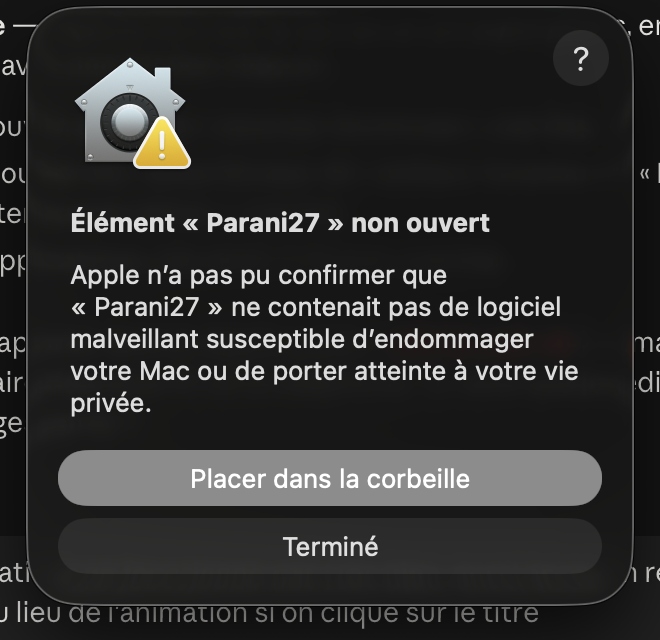
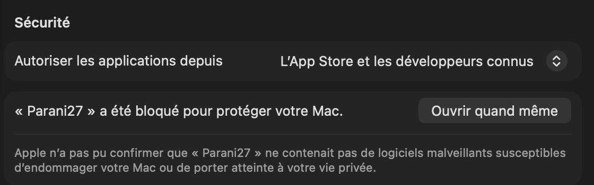

# Installer Parani27

Une application, trois appareils, une seule bibliothèque. Installe-la là où tu
lis ; branche ton compte Google (Réglages → Cloud → *Connecter mon compte
Google*) sur chaque appareil, et tes séries te suivent.

Télécharger un fichier de ce dépôt : clique dessus, puis le bouton
**Download raw file** (l'icône de téléchargement, en haut à droite).

---

## Mac

1. Télécharge [`Parani27-mac.zip`](Parani27-mac.zip) et double-clique-le :
   il donne `Parani27.app`.
2. Glisse `Parani27` dans **Applications**.
3. Double-clique-la. **macOS refuse la première fois** — l'application n'est
   pas enregistrée chez Apple (ça coûte 99 €/an, ce n'est pas un virus) :

   

   Clique **Terminé** (surtout pas *Placer dans la corbeille*).
4. Ouvre **Réglages Système → Confidentialité et sécurité**, descends
   jusqu'à **Sécurité** et clique **Ouvrir quand même** :

   

   Le Mac demande ton mot de passe, puis l'application s'ouvre. **Une seule
   fois** : ensuite elle s'ouvre normalement, et se met à jour toute seule
   (Réglages → Application).

> Sur les Mac récents, « clic droit → Ouvrir » ne suffit plus ; c'est bien
> par les Réglages que ça passe.

Ce qui est bon à savoir :
- Fermer la fenêtre quitte l'application. Pour qu'elle continue à vérifier
  les chapitres sans fenêtre : Réglages → Application → **Continuer en
  arrière-plan** (elle vit alors dans la barre des menus, en haut à droite).
- **Lancer au démarrage de macOS**, au même endroit ; avec l'arrière-plan
  coché, elle démarre sans fenêtre.
- Un chapitre s'ouvre dans ton navigateur habituel, avec tes connexions.

## Windows

1. Télécharge [`Parani27.exe`](Parani27.exe) et double-clique-le.
2. **SmartScreen** dit « Windows a protégé votre ordinateur » : clique
   **Informations complémentaires**, puis **Exécuter quand même**. Une seule
   fois.
3. Au premier lancement, l'application télécharge son moteur (44 Mo, une
   dizaine de secondes), puis s'ouvre. Ensuite elle se met à jour toute seule.

*(captures à venir)*

## Android

1. Sur le téléphone, télécharge [`lectures.apk`](lectures.apk) et ouvre-le
   (barre de notifications, ou l'application *Fichiers*).
2. Android demande d'**autoriser l'installation depuis cette source**
   (Chrome ou Fichiers) : accepte, une seule fois.
3. **Installer**. Ensuite l'application propose ses mises à jour elle-même
   (Réglages → Application) ; Android redemandera « Installer » à chaque
   fois, c'est la règle hors magasin.

*(captures à venir)*

---

## Après l'installation

- **Réglages → Cloud → Connecter mon compte Google** : la page de Google
  s'ouvre dans le navigateur, choisis ton compte, accepte l'accès *aux
  fichiers créés par l'application* (rien d'autre de ton Drive n'est
  visible). Refais-le sur chaque appareil avec le même compte : tout se
  synchronise.
- Colle le lien d'une série dans le champ du haut : titre, couverture et
  chapitres arrivent tout seuls.
